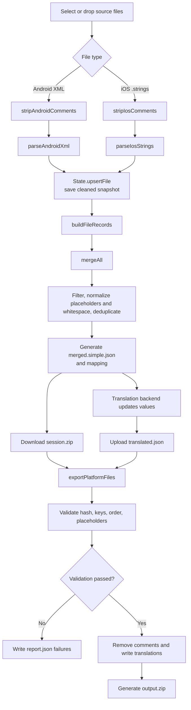

# TranslationTool

TranslationTool is an offline browser tool that merges Android XML and iOS `.strings` resources into translation JSON, then writes the translated values back to the source files.

Source files and translations are never uploaded by the tool. See [RULES.md](RULES.md) for the complete behavior and maintenance rules.

## Quick start

Open `index.html` directly from the `TranslationTool` directory, or start a local static server:

```bash
cd TranslationTool
python3 -m http.server 8765
```

Then open <http://localhost:8765>.

## Usage workflow

### 1. Import source files

- Android: select one or more XML files or a resource directory.
- iOS: select one or more `.strings` files or a directory.
- Drag and drop is supported.
- Import source-language files only, such as Android `res/values/strings.xml`.
- Do not import translated directories such as `values-de/` unless they are intentionally used as the merge source.

Comments are removed immediately after import: Android XML comments and iOS `//` and `/* ... */` comments. The cleaned content is used for previews, snapshots, and merging.

### 2. Merge and download the session package

Click **Continue to merge**, review the merged preview, then download:

- `merged.simple.json`: send this file to the translation backend.
- `session.zip`: keep this file; it is required to match source files, key order, and source positions during export.

### 3. Translate the JSON

The backend should modify JSON values only. Generated keys must remain unchanged:

```json
{
  "hello_ph_0_1": "Bonjour, {{PH_0}}!"
}
```

All `{{PH_n}}` placeholders and any `{{WS_n}}` whitespace/control tokens must be preserved with the same count and order. One JSON file represents one target language.

### 4. Export translated files

Open **Export translations**:

1. Upload the translated JSON.
2. Upload the matching `session.zip` if the merge session is no longer available in the current browser tab.
3. Click **Preview Android + iOS** to inspect the result.
4. Click **Export Android + iOS** to download `output.zip`.

`output.zip` contains the rewritten Android/iOS files and `report.json`. Exported files contain no source comments.

## Code flow



## Code structure

| File | Responsibility |
| --- | --- |
| `index.html` | Page structure and import/merge/export UI |
| `js/main.js` | UI events, file import, and workflow orchestration |
| `js/state.js` | Current session, source files, and snapshots |
| `js/parsers/androidXml.js` | Android comment removal, XML parsing, and rewriting |
| `js/parsers/iosStrings.js` | iOS comment removal, `.strings` parsing, and rewriting |
| `js/merge/mergeEngine.js` | Skip rules, deduplication, merging, and mapping |
| `js/normalize/placeholders.js` | Placeholder and whitespace normalization (`%1$s`/`%@`, `{{WS_n}}`) |
| `js/export/androidWriter.js` | Translation validation, file rewriting, and export reports |
| `js/export/zipDownload.js` | ZIP/JSON downloads and session read/write |
| `js/validate/roundtrip.js` | Browser self-tests |
| `run-tests.js` | Node.js test entry point |

## Rule summary

- Deduplication uses case-sensitive source text after placeholder and whitespace/control normalization.
- A single ASCII space stays literal; tabs, newlines, multiple spaces, and other special runs become protected `{{WS_n}}` tokens. Android/iOS strings that differ only in those characters share one translation and restore their own sequences on export.
- Quotes, backslashes, and percent signs are not collapsed by whitespace normalization.
- Source leading and trailing whitespace is not stripped.
- `%%` is treated as literal text.
- Android `formatted="false"` disables percent-format placeholder detection.
- By default, non-translatable entries, empty values, and likely secrets/URLs/emails/numbers are skipped.
- **Empty translation falls back to source** controls whether an empty translation fails or writes the original source text.
- Skipped Android entries are omitted from localized files and fall back to the default `values` resources.

See [RULES.md](RULES.md) for the detailed rules.

## Self-tests

Click **Run self-tests** in step 1, or run:

```bash
cd TranslationTool
node run-tests.js
```

## Known limitations

- Android `<plurals>` and `<string-array>` write-back is not supported yet.
- iOS `.stringsdict` and `.xcstrings` are not supported.
- Identical normalized source text shares one translation.

## Fixtures

- `fixtures/android/sample_strings.xml`
- `fixtures/ios/Localizable.strings`
