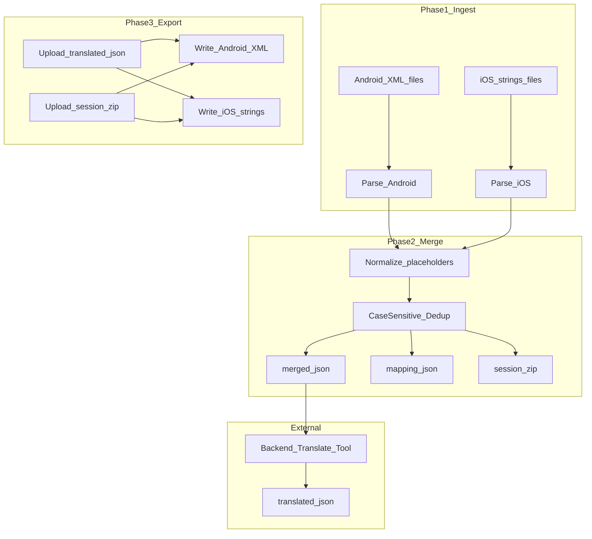

# Android/iOS 字符串合并翻译工具详细计划

> **审查修订说明（2026-08-05）**：已对照原需求与仓库现状修正分期矛盾、`file://`+ESM 风险、占位符/`%%` 规则、真实资源路径、后台 JSON 契约、多文件/flavor、输出目录命名等遗漏。

## 目标与成功标准

做一个**纯本地、无后端**的网页工具，完成：

1. 分批（或按文件夹）上传 Android 资源 XML 与 iOS `.strings`（Phase B 再加 `.stringsdict`）
2. 按**源文案值**合并去重，生成**全集** JSON 给后台翻译
3. 同时生成 `mapping.json` + **源文件快照**，保证翻译后能精确写回
4. 上传译文 JSON 后，为每端生成新文件：**key 集合不变、顺序不变、只替换可翻译 value**
5. `Continue` / `continue` / `CONTINUE` 视为 **3 条独立条目**

**成功标准（可验收）：**
- Android 实测文件：
  - [`photoart/src/main/res/values/strings.xml`](photoart/src/main/res/values/strings.xml)（约 1170 条 `<string>`）
  - [`common_libs_android/mydealslib/src/main/res/values/strings.xml`](common_libs_android/mydealslib/src/main/res/values/strings.xml)（约 1682 条；位于 submodule）
- 人为构造含相同/不同大小写/不同占位符的 iOS `.strings` 样例做联调
- 流程：合并 → 假翻译（给 `translation` 加前缀，且保留 `{{PH_n}}`）→ 回写 → key/顺序/占位符数量一致

## 默认决策（已选定）

| 项 | 决定 |
|----|------|
| 存放位置 | [`tools/string-i18n-merge/`](tools/string-i18n-merge/)（主仓库新建；不改业务代码） |
| 技术栈 | 单页 HTML + **非 ES Module 的纯 JS**（`<script src>` 顺序加载或单文件 IIFE）。**不依赖** `type="module"`，保证 `file://` 可打开；也可用本地静态服务 |
| Android 输入（Phase A） | 任意含 `<string>` 的资源 XML（不限文件名：`strings.xml` / `googlepay_strings.xml` / `string_list.xml` 等） |
| Android 输入（Phase B） | 另支持 `<plurals>`（含独立 `plurals.xml`）、`<string-array>`（含 `arrays.xml`） |
| iOS 输入（Phase A） | `*.strings`（如 `Localizable.strings`） |
| iOS 输入（Phase B） | `.stringsdict`；**暂不做** `.xcstrings`（预留） |
| 合并键 | **大小写敏感**的「占位符归一化后的源文案」（不做 locale lower、不 trim） |
| 回写依据 | **必须**有 `mapping.json` + 源文件快照（`session.zip`）；禁止仅靠 value 模糊匹配回写 |
| 后台 JSON 契约 | 扁平数组；每项 `id` + `source` + `translation`；**后台必须原样保留 `id`**，只填/改 `translation`；必须保留 `source` 中的 `{{PH_n}}` 代币不被翻译掉 |
| 非 UI 字符串 | 默认开启启发式跳过（密钥/URL/纯数字等），可关闭；`translatable="false"` 默认跳过 |

### 分期边界（避免前后矛盾）

| 能力 | Phase A (MVP) | Phase B | Phase C |
|------|---------------|---------|---------|
| Android `<string>` | 是 | — | — |
| Android `<plurals>` / `<string-array>` | 否 | 是 | — |
| iOS `.strings` | 是 | — | — |
| iOS `.stringsdict` | 否 | 是 | — |
| `.xcstrings` / 同文拆分 / 增量包 | 否 | 否 | 是 |

**目标表述中的「`.stringsdict`」仅指最终产品能力，MVP 不实现。** 目录里可放 `iosStringsdict.js` 空壳，但 Phase A 不解析。

## 整体架构与数据流



**回写最小输入**：`translated.json` + 此前下载的 `session.zip`（内含 `mapping.json` + `snapshots/`）。仅有 mapping 而无快照则无法保证注释/空白/顺序级保真。

## 目录结构

```text
tools/string-i18n-merge/
  index.html
  css/app.css
  js/
    main.js
    state.js                 # 仅内存会话；大快照禁止写入 localStorage
    parsers/
      androidXml.js
      iosStrings.js
      iosStringsdict.js      # Phase B；Phase A 可为空实现
    normalize/
      placeholders.js
      unescape.js
    merge/
      mergeEngine.js
      filters.js
    export/
      androidWriter.js
      iosWriter.js
      zipDownload.js         # 优先 vendor/jszip.min.js 离线；CDN 仅作备选
    validate/
      roundtrip.js
  vendor/
    jszip.min.js             # 建议入库，避免 file:// + 无网不可用
  fixtures/
    android/sample_strings.xml
    ios/Localizable.strings
  README.md
```

## 核心数据模型

### 1) `SourceEntry`（解析结果）

```js
{
  platform: "android" | "ios",
  fileId: "photoart/src/main/res/values/strings.xml", // 优先用 webkitRelativePath / 用户可编辑相对路径
  key: "TXT_CLOSE",
  rawValue: "Close",           // 文件中读到的原始字面（解码前）
  decodedValue: "Close",       // 解码后；合并与展示用
  entryType: "string",         // Phase B: "plural" | "array_item"
  pluralQuantity: null,
  arrayIndex: null,
  order: 42,                   // 该文件内出现顺序，从 0
  attributes: {
    translatable: true,
    formatted: true,           // Android formatted="false" 时为 false
    toolsIgnore: null          // 原样保留，不参与逻辑
  },
  skipReason: null | "translatable_false" | "heuristic_secret" | "empty" | "resource_ref"
}
```

### 2) `MergedItem`（merged.json）

**精简版（给后台，默认下载）：**

```json
[
  { "id": "v1_a1b2c3d4", "source": "Hello, {{PH_0}}!", "translation": "" }
]
```

**完整版（人工核对，可选下载）：** 在精简字段上增加 `meta`：

```json
{
  "id": "v1_a1b2c3d4",
  "source": "Hello, {{PH_0}}!",
  "translation": "",
  "meta": {
    "originalSamples": {
      "android": "Hello, %1$s!",
      "ios": "Hello, %@!"
    },
    "platforms": ["android", "ios"],
    "occurrenceCount": 5,
    "refs": [
      { "platform": "android", "fileId": "...", "key": "..." }
    ]
  }
}
```

`id` 生成：对「归一后 source」做稳定哈希（如 SHA-256 截断），前缀 `v1_`；相同 source 永远同一 id，便于增量重跑。

### 3) `mapping.json` + snapshots

```json
{
  "version": 1,
  "createdAt": "ISO-8601",
  "toolVersion": "1.0.0",
  "files": [
    {
      "fileId": "photoart/src/main/res/values/strings.xml",
      "platform": "android",
      "contentHash": "sha256...",
      "entries": [
        {
          "order": 35,
          "key": "TXT_SHARE_SMS_EMAIL_B",
          "entryType": "string",
          "mergedId": "v1_xxxx",
          "skipped": false,
          "skipReason": null,
          "originalDecoded": "I just used ... %1$s ... %2$s",
          "placeholderPattern": ["%1$s", "%2$s"],
          "normalizeTokens": ["{{PH_0}}", "{{PH_1}}"]
        }
      ]
    }
  ]
}
```

`session.zip` 结构：

```text
session.zip
  mapping.json
  merged.simple.json
  merged.full.json          # 可选
  snapshots/
    android/<fileId 路径镜像>/...
    ios/<fileId 路径镜像>/...
  manifest.json             # toolVersion、文件列表、选项快照
```

## 合并与去重规则

### 大小写

- **严格区分大小写**（Unicode 码点级，不做 `toLowerCase`）
- `Continue` ≠ `continue` ≠ `CONTINUE` → 三个 `id`

### 空白与标点

- **不 trim** 首尾空格（仓库中已有尾随空格，如 `TXT_INCREASE_QUANTITY`）
- **不规范化** 弯引号/弯撇号（如 `it's` U+2019）与直号；保持原文
- UI 可标记「含首尾空白」警告，但不自动修改

### 占位符归一

从左到右扫描，替换为 `{{PH_0}}`, `{{PH_1}}`, ...

| 平台 | Phase A 识别 |
|------|----------------|
| Android | `%[1-9]$\w`（如 `%1$s` `%2$d`）、`%s` `%d` `%f` 等常见转换符 |
| iOS | `%@` `%d` `%ld` `%f` `%1$@` / `%1$d` 等位置型 |
| 通用 | 已有 `{{name}}`、`{0}` 视为占位并纳入 token 序列 |

**例外（易错点，必须写清）：**
- `%%`（Android/iOS 字面百分号）：**不**变成 `{{PH_n}}`，归一后保留为 `%%`（或统一成字面 `%` 的单一约定，并在编解码往返测试中锁定一种）
- Android `formatted="false"`：该条目**不做** `%` 占位符识别（整段当普通文本），避免把字面 `%` 当 format
- 占位符**类型不同但正文相同**（如仅 `%s` vs `%d`）：归一后会合并；回写时各自用 mapping 的 `placeholderPattern` 还原——这是刻意行为，README 说明

**给译员/后台的硬约束：**
- `source` / `translation` 中的 `{{PH_0}}`… 必须原样保留、数量与顺序一致
- 工具在导出前做硬校验；失败项不写回并进入 `report.json`

### 转义编解码

**Android 读入：**
- 资源转义：`\'` `\"` `\n` `\t` `\\` `@`/`?` 字面规则按 Android 文档处理到够用程度
- XML 实体：`&amp;` `&lt;` `&gt;` `&apos;` `&quot;`
- 内嵌 HTML（如 `<u>...</u>`）保留进 `decodedValue` / `source`
- 解析器必须容忍属性周围空白（仓库存在 `name="..." >` 这类写法）

**Android 写出：**
- 只替换对应 `<string>...</string>`（或 Phase B 的 item）的**文本内容**
- 禁止全文件 pretty-print；保留注释、`xmlns:tools`、`tools:ignore` 等属性

**iOS `.strings`：**
- 支持 `"key" = "value";`
- 支持 `/* ... */` 与 `//` 注释（解析跳过，回写保留——快照定点替换天然保留）
- 转义：`\"` `\\` `\n` `\t`

### 跳过规则

| 条件 | 默认行为 | mapping |
|------|----------|---------|
| `translatable="false"` | 不进 merged | `skipped: true` |
| 启发式：长 key 串、`.apps.googleusercontent.com`、纯 URL/邮箱/纯数字、空字符串 | 不进 merged | `skipped: true` + `skipReason` |
| value 为 `@string/...` 资源引用（若出现） | 不进 merged | `skipped: true`, `resource_ref` |
| 空 `<item />`（plurals 中存在） | Phase B 跳过 | skipped |

被跳过条目回写时**不改 value**（快照保留即正确）。

提供：「被跳过列表」下载 + 关闭启发式开关。

### 同文异义

Phase A：**按归一后 value 强制合并**（两端 UI 一致的目标）。  
完整版 JSON / UI 展示 `occurrenceCount` 与 `refs`。  
Phase C 再做「强制拆分为多 id」。

### 跨文件同 key

Android 不同 module/flavor 可出现相同 `name`、不同 value：
- 以 `fileId + key + order` 区分 SourceEntry
- 若 value 相同则合并翻译；若不同则两条 merged
- UI 对「同 key 不同 value」给警告（便于发现配置问题）

## 仓库现状要点（实现时必须覆盖）

- 主包 strings：[`photoart/src/main/res/values/strings.xml`](photoart/src/main/res/values/strings.xml)
- 另有：`plurals.xml`、`arrays.xml`、`googlepay_strings.xml`、`string_list.xml`（Phase A 至少能解析其中的 `<string>`；无 `<string>` 的文件提示「0 条」而非报错）
- mydealslib（submodule）主 strings：`common_libs_android/mydealslib/src/main/res/values/strings.xml`
- mydealslib 还有 flavor 目录：`src/free/`、`src/us_fla/`、`src/easy/` 等——**由用户选择上传哪些**；工具不自动扫仓库
- 已有 `values-de/` 等是**历史译文**，不是本工具默认输入；产出是「某一目标语言」文件，用户手动放入 `values-xx`
- 真实文案含：`%1$s`、`%d`、`\'`、`\n`、`&amp;`、`<u>`、尾随空格、Trademark 符号

## UI 流程（三步向导）

### Step 1 — 导入源文件

- Android / iOS 两个独立区：多选文件 **或** 选文件夹（`webkitdirectory`，用 `webkitRelativePath` 作 `fileId`）
- 列表：路径、条数、跳过数、同文件重复 key 警告
- 选项：包含 `translatable=false`、关闭启发式、（导出时）精简/完整 JSON
- 按钮：清空一端 / 重新解析

### Step 2 — 合并预览与下载

- 统计：Android 有效条数、iOS 有效条数、合并唯一条数、仅 Android / 仅 iOS / 两端共有、跳过条数
- 可搜索表格：source / platforms / occurrences
- **必须引导下载 `session.zip`**（回写必需）；另可单独下 `merged.simple.json` 方便只丢给后台

### Step 3 — 上传译文并导出

- 上传 `translated.json`（数组；校验每项含 `id`）
- 上传 `session.zip`（若当前内存会话仍完整可跳过）
- 输入 **目标语言目录名**（如 `values-fr` / `fr.lproj`），仅用于导出 zip 内文件夹命名，**不改 key**
- 校验：`mergedId` 覆盖、占位符数量/顺序、空 translation 策略（默认：空则失败；可选「回退 source」）
- 下载：`output.zip` → `android/...`、`ios/...`、`report.json`

## 回写算法（保证 key 与顺序）

1. 解压 session，按 `contentHash` 校验快照未被替换错文件
2. 对每个快照用**同一 parser** 再解析，断言与 mapping 的 `key + order + entryType` 一致；不一致则中止并提示重新导入
3. 对非 skipped 条目：取 translation → 按该条目 `normalizeTokens`↔`placeholderPattern` 还原占位符 → 按平台规则转义 → **定点替换**快照中的 value 区间
4. skipped / 校验失败：不改该 value；失败列入 report
5. 最终再 parse 一次：key 列表与顺序必须与源 deep-equal

禁止：重新序列化整棵 XML 树导致属性重排、注释丢失、自闭合变展开等。

## 后台契约（写进 README，避免对接失败）

1. 输入：`merged.simple.json` 数组
2. 输出：同结构数组，**`id` 不可改**，`source` 建议保留，`translation` 填目标语言
3. `{{PH_n}}` 视为不可翻译代币
4. 一次 JSON = **一种目标语言**；多语言则多次翻译或多次导出
5. 若后台只能接受 `Map<source, translation>`：本工具可在 Phase C 做适配；MVP **要求带 id**，因同文不同 case 不能靠 source 当唯一键以外的丢失风险——实际上 source 已区分 case，但 id 仍是跨次运行的稳定句柄

## 技术风险与对策

| 风险 | 对策 |
|------|------|
| `file://` 下 ES Module CORS 失败 | **不用** `type="module"`；script 标签顺序加载 |
| localStorage 存不下快照 | 快照只放内存 + session.zip；localStorage 最多存 UI 选项 |
| CDN JSZip 离线不可用 | `vendor/jszip.min.js` 入库 |
| 仅 value 合并同文异义 | UI 展示 refs；README 风险；Phase C 拆分 |
| 占位符被译坏 | 导出前硬校验 |
| 翻译期间源文件变更 | contentHash；要求用原 session.zip |
| 多 flavor 传错文件 | 用户自选；fileId 展示完整相对路径 |
| submodule 内文件 | 从磁盘选文件上传即可；git add 规则与工具无关 |
| 大表 3000+ 行卡顿 | MVP 可全量渲染；卡顿再虚滚 |

## 实现分期

### Phase A — MVP

1. Android `<string>` 解析/回写（转义、`translatable`、`formatted`、tools 属性保留）
2. iOS `.strings` 解析/回写（注释保留靠快照）
3. 占位符归一（含 `%%` 例外、`formatted=false`）
4. 大小写敏感合并 + mapping + session.zip
5. 三步 UI + 校验 report + 目标语言目录名

### Phase B — 复数与数组

1. Android `<plurals>` / `<string-array>`（含空 item）
2. iOS `.stringsdict`
3. 更完整 report

### Phase C — 增强

1. 同 value 强制拆分
2. `.xcstrings`
3. 无 id 的 map 型后台结果适配
4. 与已有 `values-xx` 做增量翻译包

## 测试计划（实现时执行；不跑 gradlew）

1. 编解码往返、占位符归一往返（含 `%%`、`%1$s`、`%@`、弯撇号）
2. 三大小写 Continue → 3 个 id
3. Android `Hello, %1$s` + iOS `Hello, %@` → 1 个 id；回写各端占位符正确
4. 假翻译后 key/顺序/attributes 与源一致
5. 真实导入 photoart + mydealslib main strings.xml，往返条数与 key 集合一致
6. `dropbox_api_key` 等启发式跳过不进 simple.json
7. `file://` 打开 index.html 可完成全流程（有 vendor JSZip）

## 文档交付

[`tools/string-i18n-merge/README.md`](tools/string-i18n-merge/README.md) 必须包含：
- 打开方式（`file://` 与本地 server）
- 推荐工作流：导入 → 下 session.zip + simple.json → 后台翻译 → 回传 translated + session → 导出
- 后台 JSON 契约（id / `{{PH_n}}`）
- 大小写、空白、占位符、`%%`、`formatted=false` 规则
- 应上传哪些 Android 文件（main vs flavor；不要误传已翻译的 `values-de`）
- 已知限制：MVP 无 plurals/stringsdict/xcstrings；同文异义强制合并
